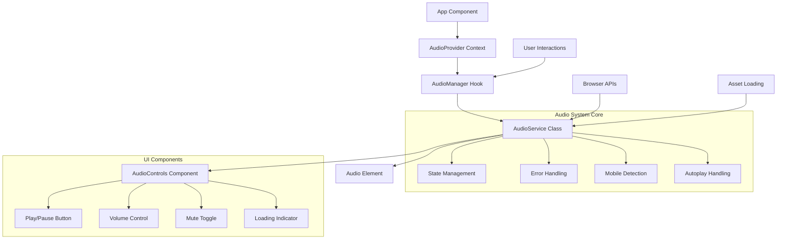
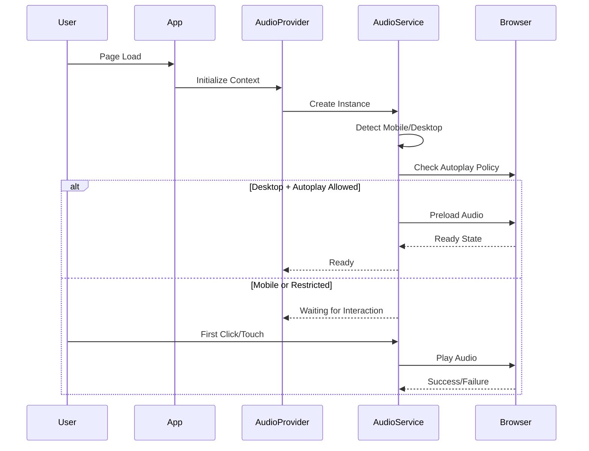
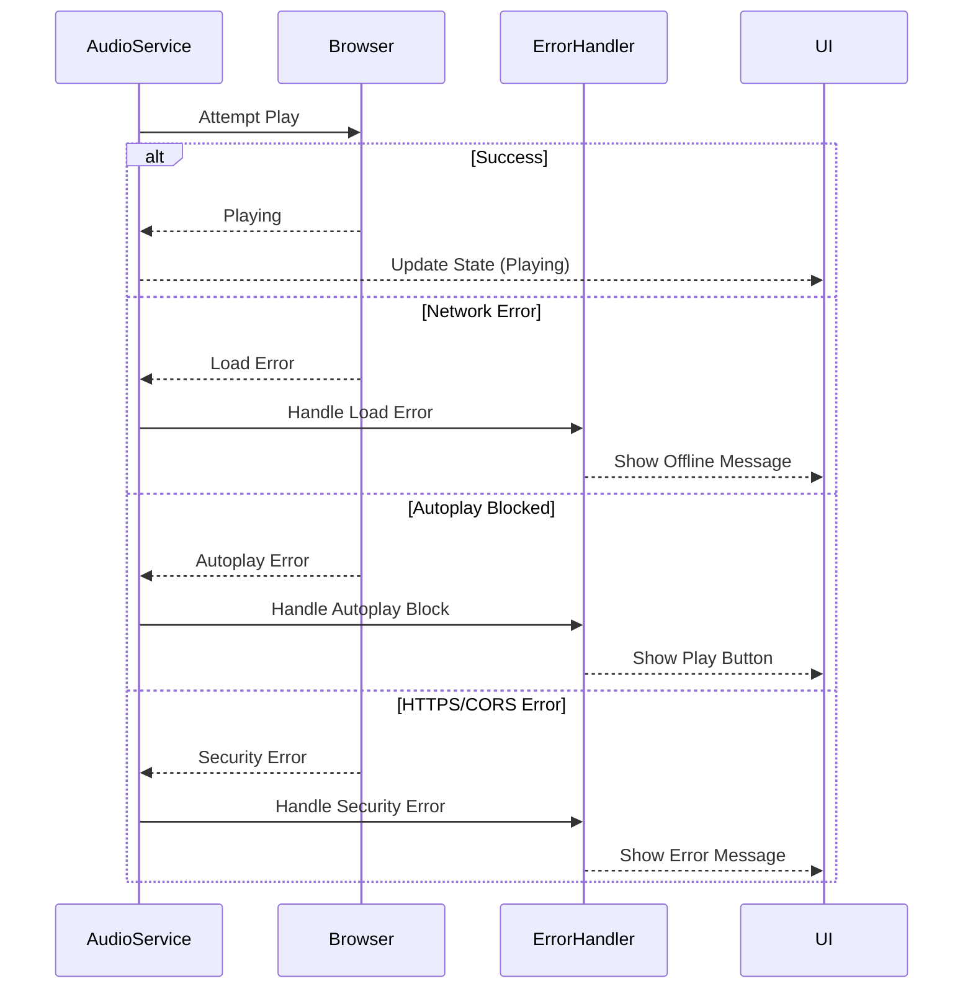

# Design Document: Audio System Enhancement

## Overview

The enhanced audio system addresses critical production deployment issues with the current pirate song audio implementation in the Stand Up 2K26 website. The system provides robust audio playback with proper HTTPS support, comprehensive browser compatibility, user controls, and graceful fallbacks for mobile devices. The solution replaces the current fragile audio implementation with a production-ready audio management system that handles autoplay restrictions, provides user controls, and ensures consistent behavior across all deployment environments.

## Architecture



## Sequence Diagrams

### Main Audio Initialization Flow



### Error Handling Flow



## Components and Interfaces

### AudioProvider Context

**Purpose**: Provides global audio state management and controls to all components

**Interface**:
```typescript
interface AudioContextType {
  isPlaying: boolean;
  volume: number;
  isMuted: boolean;
  isLoading: boolean;
  error: string | null;
  canPlay: boolean;
  play: () => Promise<void>;
  pause: () => void;
  setVolume: (volume: number) => void;
  toggleMute: () => void;
  retry: () => void;
}

interface AudioProviderProps {
  children: React.ReactNode;
  audioSrc: string;
  autoPlay?: boolean;
  volume?: number;
}
```

**Responsibilities**:
- Manage global audio state across the application
- Provide audio control methods to child components
- Handle context initialization and cleanup

### AudioService Class

**Purpose**: Core audio management with browser compatibility and error handling

**Interface**:
```typescript
class AudioService {
  constructor(src: string, options: AudioOptions);
  
  // Playback Control
  play(): Promise<void>;
  pause(): void;
  stop(): void;
  
  // Volume Control
  setVolume(volume: number): void;
  getVolume(): number;
  mute(): void;
  unmute(): void;
  
  // State Management
  getState(): AudioState;
  addEventListener(event: AudioEvent, callback: Function): void;
  removeEventListener(event: AudioEvent, callback: Function): void;
  
  // Cleanup
  destroy(): void;
}

interface AudioOptions {
  autoPlay?: boolean;
  loop?: boolean;
  volume?: number;
  preload?: 'none' | 'metadata' | 'auto';
}

interface AudioState {
  isPlaying: boolean;
  isLoading: boolean;
  canPlay: boolean;
  currentTime: number;
  duration: number;
  volume: number;
  isMuted: boolean;
  error: string | null;
}
```

**Responsibilities**:
- Direct audio element manipulation and state management
- Browser compatibility detection and polyfills
- Error handling and recovery strategies
- Mobile-specific optimizations

### AudioControls Component

**Purpose**: User interface for audio playback controls

**Interface**:
```typescript
interface AudioControlsProps {
  className?: string;
  showVolume?: boolean;
  showProgress?: boolean;
  position?: 'top-right' | 'bottom-right' | 'bottom-left' | 'top-left';
  theme?: 'light' | 'dark' | 'pirate';
}
```

**Responsibilities**:
- Provide accessible audio controls
- Display loading and error states
- Handle user interactions for play/pause/volume
- Support theming for different UI contexts

## Data Models

### AudioState Model

```typescript
interface AudioState {
  isPlaying: boolean;
  isLoading: boolean;
  canPlay: boolean;
  currentTime: number;
  duration: number;
  volume: number;
  isMuted: boolean;
  error: string | null;
  networkState: number;
  readyState: number;
}
```

**Validation Rules**:
- volume must be between 0 and 1
- currentTime must be non-negative and <= duration
- readyState must be valid HTML5 audio ready state value

### AudioConfig Model

```typescript
interface AudioConfig {
  src: string;
  autoPlay: boolean;
  loop: boolean;
  volume: number;
  preload: 'none' | 'metadata' | 'auto';
  crossOrigin?: 'anonymous' | 'use-credentials';
  enableControls: boolean;
  fallbackMessage?: string;
}
```

**Validation Rules**:
- src must be valid URL or relative path
- volume must be between 0 and 1
- preload must be valid HTML5 preload value

## Algorithmic Pseudocode

### Main Audio Initialization Algorithm

```typescript
ALGORITHM initializeAudioSystem(config: AudioConfig)
INPUT: config containing audio source and options
OUTPUT: initialized audio service instance

BEGIN
  ASSERT config.src !== null AND config.src !== ""
  ASSERT config.volume >= 0 AND config.volume <= 1
  
  // Step 1: Environment Detection
  isMobile ← detectMobileDevice()
  hasAutoplaySupport ← await checkAutoplaySupport()
  isHTTPS ← location.protocol === 'https:'
  
  // Step 2: Configure Audio Element with environment-specific settings
  audioElement ← createAudioElement()
  audioElement.src ← resolveAssetPath(config.src, isHTTPS)
  audioElement.loop ← config.loop
  audioElement.volume ← config.volume
  
  // Step 3: Apply Mobile-Specific Optimizations
  IF isMobile THEN
    audioElement.preload ← 'none'  // Save bandwidth
    config.autoPlay ← false        // Respect mobile UX
  ELSE
    audioElement.preload ← config.preload
  END IF
  
  // Step 4: Set up Event Listeners with Error Boundaries
  FOR each event IN ['loadstart', 'canplay', 'error', 'ended'] DO
    ASSERT eventHandler[event] IS DEFINED
    audioElement.addEventListener(event, eventHandler[event])
  END FOR
  
  // Step 5: Attempt Initial Load with Graceful Degradation
  TRY
    await audioElement.load()
    IF config.autoPlay AND hasAutoplaySupport THEN
      await attemptAutoplay(audioElement)
    END IF
  CATCH error
    handleAudioError(error, config.fallbackMessage)
  END TRY
  
  ASSERT audioElement.readyState >= HTMLMediaElement.HAVE_CURRENT_DATA
  
  RETURN new AudioService(audioElement, config)
END
```

**Preconditions**:
- config.src is a valid audio file URL or path
- config.volume is between 0 and 1
- Browser supports HTML5 audio
- DOM is loaded and ready

**Postconditions**:
- Audio service is properly initialized
- Event listeners are attached
- Audio element is loaded or loading
- Error handling is active

**Loop Invariants**:
- All event listeners remain properly attached throughout initialization
- Audio element state remains consistent during setup

### Autoplay Handling Algorithm

```typescript
ALGORITHM handleAutoplayAttempt(audioElement: HTMLAudioElement)
INPUT: configured audio element
OUTPUT: autoplay success status

BEGIN
  // Check autoplay policy before attempting
  policy ← await navigator.getAutoplayPolicy('mediaelement')
  
  IF policy === 'allowed' THEN
    TRY
      await audioElement.play()
      RETURN { success: true, method: 'direct' }
    CATCH error
      // Autoplay blocked despite policy - fallback
      RETURN handleAutoplayFailure(error)
    END TRY
  
  ELSE IF policy === 'allowed-muted' THEN
    originalVolume ← audioElement.volume
    audioElement.volume ← 0
    
    TRY
      await audioElement.play()
      // Gradually increase volume after successful muted start
      await fadeInVolume(audioElement, originalVolume)
      RETURN { success: true, method: 'muted-start' }
    CATCH error
      audioElement.volume ← originalVolume
      RETURN handleAutoplayFailure(error)
    END TRY
  
  ELSE
    // Autoplay disallowed - wait for user interaction
    RETURN { success: false, method: 'user-interaction-required' }
  END IF
END
```

**Preconditions**:
- audioElement is properly configured and loaded
- Browser supports autoplay policy detection
- Audio source is accessible

**Postconditions**:
- Autoplay attempt result is clearly defined
- Audio element volume is properly restored if modified
- User interaction requirements are communicated

**Loop Invariants**:
- Audio element remains in valid state throughout all operations

### Error Recovery Algorithm

```typescript
ALGORITHM recoverFromAudioError(error: AudioError, retryCount: number)
INPUT: error details and current retry attempt number
OUTPUT: recovery action result

BEGIN
  ASSERT retryCount >= 0
  ASSERT retryCount <= MAX_RETRY_ATTEMPTS
  
  // Classify error type for appropriate recovery
  errorType ← classifyAudioError(error)
  
  SWITCH errorType
    CASE 'NetworkError':
      IF retryCount < MAX_NETWORK_RETRIES THEN
        delay ← calculateExponentialBackoff(retryCount)
        await sleep(delay)
        RETURN retryAudioLoad(retryCount + 1)
      ELSE
        RETURN showOfflineFallback()
      END IF
    
    CASE 'NotAllowedError':
      RETURN requireUserInteraction()
    
    CASE 'NotSupportedError':
      RETURN showUnsupportedFormatMessage()
    
    CASE 'SecurityError':
      IF location.protocol === 'http:' THEN
        RETURN suggestHTTPSUpgrade()
      ELSE
        RETURN showCORSErrorMessage()
      END IF
    
    DEFAULT:
      IF retryCount < MAX_GENERAL_RETRIES THEN
        RETURN retryAudioLoad(retryCount + 1)
      ELSE
        RETURN showGenericErrorFallback()
      END IF
  END SWITCH
END
```

**Preconditions**:
- error is a valid audio-related error object
- retryCount is within acceptable bounds
- Error classification system is available

**Postconditions**:
- Appropriate recovery action is taken based on error type
- User is informed of error state and possible actions
- System gracefully handles unrecoverable errors

**Loop Invariants**:
- Retry count never exceeds maximum allowed attempts
- Error state remains consistent throughout recovery process

## Key Functions with Formal Specifications

### Function 1: createAudioService()

```typescript
function createAudioService(
  src: string, 
  options: AudioOptions
): Promise<AudioService>
```

**Preconditions:**
- `src` is non-empty string representing valid audio file path
- `options.volume` is between 0 and 1 (inclusive)
- `options.preload` is one of: 'none', 'metadata', 'auto'
- Browser supports HTML5 audio element

**Postconditions:**
- Returns AudioService instance with initialized audio element
- Audio element has all required event listeners attached
- Service is ready to handle playback commands
- Error handling is active and configured

**Loop Invariants:** N/A (no loops in function)

### Function 2: handleUserInteraction()

```typescript
function handleUserInteraction(
  audioService: AudioService, 
  interactionType: InteractionType
): Promise<PlaybackResult>
```

**Preconditions:**
- `audioService` is properly initialized AudioService instance
- `interactionType` is valid user interaction event ('click', 'touch', 'keypress')
- Audio element is in ready state (readyState >= 2)

**Postconditions:**
- Audio playback starts if autoplay was previously blocked
- User interaction requirement is cleared for future autoplay
- Playback result indicates success or specific failure reason
- Audio controls become available for user manipulation

**Loop Invariants:** N/A (no loops in function)

### Function 3: synchronizeVolumeWithStorage()

```typescript
function synchronizeVolumeWithStorage(
  audioService: AudioService
): void
```

**Preconditions:**
- `audioService` is initialized and active
- localStorage is available and accessible
- Audio element supports volume modification

**Postconditions:**
- Audio volume matches stored user preference (if exists)
- Current volume is persisted to localStorage
- Volume changes are reflected in UI controls
- Mute state is consistent with stored preferences

**Loop Invariants:** N/A (no loops in function)

## Example Usage

```typescript
// Example 1: Basic Audio Setup in App Component
import { AudioProvider, useAudio } from './audio/AudioProvider';

function App() {
  return (
    <AudioProvider
      audioSrc="/assets/pirate.mp3"
      autoPlay={true}
      volume={0.12}
    >
      <MainContent />
      <AudioControls position="top-right" theme="pirate" />
    </AudioProvider>
  );
}

// Example 2: Using Audio Controls in Components
function MainContent() {
  const { isPlaying, play, pause, error } = useAudio();
  
  const handlePlayToggle = async () => {
    if (isPlaying) {
      pause();
    } else {
      try {
        await play();
      } catch (err) {
        console.error('Playback failed:', err);
      }
    }
  };
  
  if (error) {
    return <div>Audio unavailable: {error}</div>;
  }
  
  return (
    <div>
      <button onClick={handlePlayToggle}>
        {isPlaying ? 'Pause' : 'Play'} Pirate Song
      </button>
    </div>
  );
}

// Example 3: Advanced Audio Service Usage
const audioService = await createAudioService('/assets/pirate.mp3', {
  autoPlay: false,
  loop: true,
  volume: 0.12,
  preload: 'metadata'
});

audioService.addEventListener('play', () => {
  console.log('Audio started playing');
});

audioService.addEventListener('error', (error) => {
  console.error('Audio error:', error);
});

// Attempt playback with error handling
try {
  await audioService.play();
} catch (error) {
  if (error.name === 'NotAllowedError') {
    // Show user interaction prompt
    showPlayButton();
  } else {
    // Handle other errors
    showErrorMessage(error.message);
  }
}
```

## Correctness Properties

The audio system maintains the following universal properties:

**Property 1: Volume Consistency**
```typescript
∀ audioService: AudioService, volume: number ∈ [0,1] →
  audioService.setVolume(volume) ⟹ audioService.getVolume() = volume
```

**Property 2: State Synchronization**
```typescript
∀ audioService: AudioService →
  audioService.isPlaying() = true ⟹ audioElement.paused = false ∧
  audioService.isPlaying() = false ⟹ audioElement.paused = true
```

**Property 3: Error Recovery**
```typescript
∀ error: AudioError, retryCount: number →
  retryCount ≤ MAX_RETRIES ⟹ recoverFromError(error, retryCount) ≠ null
```

**Property 4: Mobile Optimization**
```typescript
∀ device: Device →
  isMobile(device) = true ⟹ 
    audioElement.preload = 'none' ∧ autoPlay = false
```

**Property 5: HTTPS Compatibility**
```typescript
∀ audioSrc: string, protocol: string →
  protocol = 'https:' ⟹ resolveAssetPath(audioSrc, true) starts with 'https:'
```

## Error Handling

### Error Scenario 1: Network Connectivity Loss

**Condition**: Audio fails to load due to network issues or server unavailability
**Response**: Display offline indicator, attempt automatic retry with exponential backoff
**Recovery**: Resume normal operation when network connectivity is restored

### Error Scenario 2: Autoplay Policy Violation

**Condition**: Browser blocks autoplay due to user preferences or policy
**Response**: Show subtle play button prompt, preserve user's audio preferences
**Recovery**: Enable full audio functionality after first user interaction

### Error Scenario 3: Unsupported Audio Format

**Condition**: Browser cannot decode the provided audio format
**Response**: Display graceful fallback message, suggest browser update if applicable
**Recovery**: Provide alternative audio format or disable audio features cleanly

### Error Scenario 4: HTTPS/Security Restrictions

**Condition**: Mixed content or CORS policy prevents audio loading
**Response**: Display security-related error message, suggest HTTPS upgrade
**Recovery**: Ensure all audio assets are served over HTTPS in production

## Testing Strategy

### Unit Testing Approach

Focus on testing individual audio service methods, error handling functions, and state management utilities. Key test cases include volume control validation, error recovery mechanisms, and mobile detection accuracy. Achieve >90% coverage for core audio functionality.

### Property-Based Testing Approach

**Property Test Library**: fast-check (for TypeScript/JavaScript)

Generate random audio configurations, user interaction sequences, and error conditions to verify system robustness. Test properties include volume consistency, state synchronization, and error recovery reliability across diverse scenarios.

### Integration Testing Approach

Test complete audio workflows including initialization, user interactions, error scenarios, and cleanup. Verify compatibility across different browsers, devices, and network conditions using automated browser testing tools.

## Performance Considerations

- Lazy load audio assets to reduce initial page load time
- Use audio sprite techniques for multiple short sounds if applicable
- Implement intelligent preloading based on user behavior patterns
- Optimize audio file compression and format selection for web delivery
- Cache audio control preferences to avoid repeated localStorage access

## Security Considerations

- Ensure all audio assets are served over HTTPS in production
- Implement proper CORS headers for cross-domain audio requests
- Validate audio source URLs to prevent XSS through malicious audio paths
- Sanitize user-provided audio configuration to prevent injection attacks
- Use Content Security Policy (CSP) to restrict audio source domains

## Dependencies

- React 18+ (existing dependency)
- Modern browser with HTML5 audio support
- HTTPS deployment environment for production
- Optional: Web Audio API for advanced audio processing features
- Optional: Service Worker for offline audio caching capabilities